# ece1779-a2

## Overview
This project is a python-based web application that allows manager to control worker pools, each of which is an EC2 instance. Manager itself is deployed on a single EC2 and is set to run on port 5000.The size of worker pool can be scaled manually and automatically.  All images are saved in S3 and all data is saved in RDS.

It also allows users to upload images and get the processed ones with objects detected. The load of user app is balanced by Load Balancer. 

DNS name: ece1779-243010613.us-east-1.elb.amazonaws.com
AMI ID: ami-0016a2318cd331666


## Group members
* Hongyu Liu 1005851295   
* Ran Wang 1006126951   
* Zixiang Ma 1005597285  

## Quick Start

### Access to AWS EC2 instance
Use the command below to access EC2 instance. The project is placed at root directory and please use the start up script to launch. 
```
ssh -i "keypair.pem" ubuntu@ec2-54-159-34-94.compute-1.amazonaws.com
```

### Start Server

To start the deployed server on EC2, execute the start up script at Desktop directory with command below. 
```
~/Desktop/$ sudo bash start.sh
```

### Manager account

There is an pre-registered manager account, feel free to use it.

```
Manager name: admin
Password : password
```

## Major Dependencies
```
Python 3.7
Flask 1.1.1
Gunicorn 20.0.4
``` 

## User app interface

### Authentication view
Users are required to be authenticated before uploading images. Unauthenticated accesses will be redirected to the login page. 
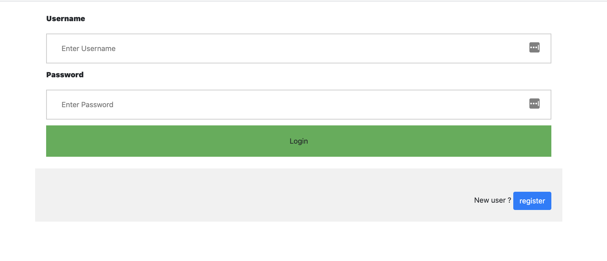  

During registration, users should provide a unique username and a password. Username should have 2 to 100 characters, and contains only letters, numbers, dash and underscore. Password should have 6 or more characters. Validation of username and password is performed on server end. Users will be redirected to the login page upon successful registration. 
  

### Profile view
Users will be redirected to profile upon successful login. The profile view contains an image upload form and a gallery of thumbnails of the processed images. Users can select an image file and click on the upload button to add a new image to the profile. In the gallery section, users can only view the images uploaded by themselves.

  


### Image view
By clicking on the thumbnails, users will be redirected to the image page that shows the original image and the image processed by the object detection modules. 


## API Interface

This application exposes two endpoints below for testing purposes.   
  ### Registration
  This endpoint accepts HTTP POST requests to register a user. There are two string parameters in this request: username and password. The endpoint will return a login HTML view with code 201 upon successful registration. If the parameters are not in the requested format, a flash message will ask users to change username and password format, code 200 will be returned.

  * Request URL: http://host/api/register    
  * HTTP method: POST    
  * Request parameters  
    * username - String 
    * password - String
  * Response: - JSON
  ~~~
    {
      'isSuccess': True,
      'url': url_for('user.login')
    }

    {
      'isSuccess': False,
      'message': "error message"
    }
  ~~~

  ### Image
  
  This endpoint accepts HTTP POST requests to add an image to user's gallery. This request should include two string parameters: username and password; and a file parameter: file. The encrypt property of this request should be set to multipart/form-data.
  * Request URL: http://host/api/upload
  * HTTP method: POST
  * Request parameters
    * username - String
    * password - String
    * file - file
  * Response - JSON
    ~~~
    {
      success: true
    }

    {
      success: false,
      message: "error message"
    }
    ~~~

## Manager app interface
The dashboard page shows two charts. The first chart shows the total CPU utilization of the worker for the past 30 minutes with the resolution of 1 minute. The second chart shows the rate of HTTP requests received by the worker in each minute for the past 30 minutes.
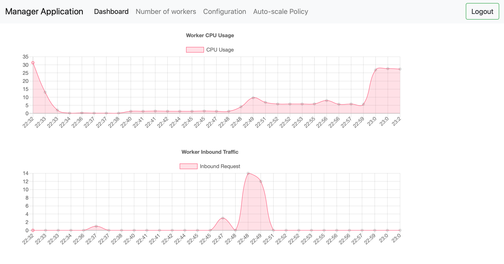

The page "Number of workers" shows the number of workers for the past 30 minutes with the resolution of 1 minute.


The configuration page displays the load-balancer DNS name and the information of all the instances in the worker pool. There are four buttons on this page. Administrators can manually increase one instance by clicking the scale up button. They can manually decrease one instance by clicking the scale down button. The "Clear all" button will delete application data stored on the database as well as all images stored on S3. The "Terminate" button will terminate all the workers and then stop the
manager itself.
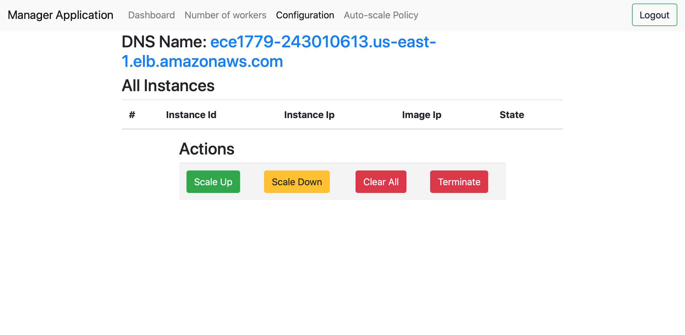

The page "Auto-scale Policy" asks administrators to input the upper and lower threshold and the increase and decrease ratio to set a new auto scale policy.
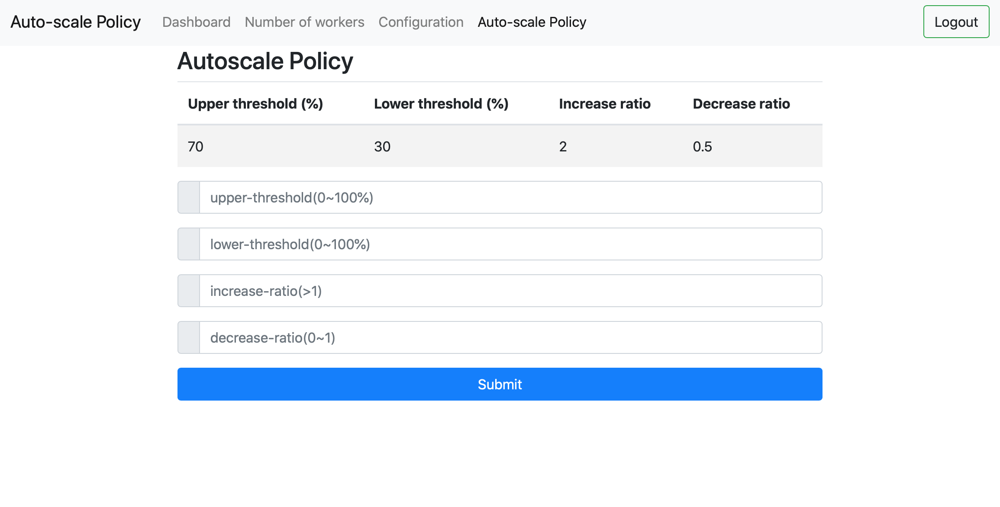

## System Architectures
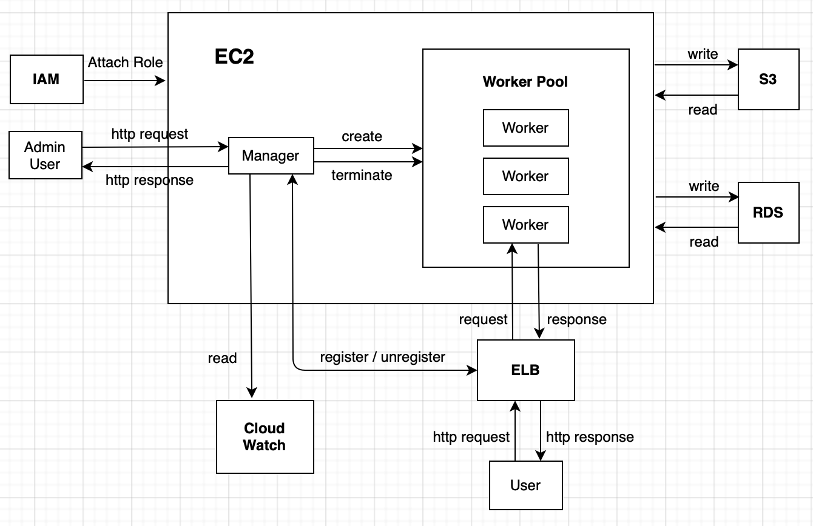 

The worker pool on EC2 contains workers on which runs the user app. User app will read/write data from/to AWS RDS. Pictures uploaded by users and generated by the user app will be stored on AWS S3. 

Manager app on EC2 is allowed to control the work pool, which can create or terminate instances. Once a worker is created or terminated on EC2, ELB will register/de-register it. ELB automatically distributes the http requests from users to workers in the worker pool to allow each worker to handle the requests evenly.

Manager app accepts http requests from the admin users to load worker information, change the worker pool size, clear the database and S3 bucket, terminate worker instances and stop the manager instance. Manager app gets the worker information from AWS Cloud Watch.

An IAM role is attached to all workers on EC2 so that they can have access to the S3 bucket, cloud watch, and elastic load balancer.

The gunicorn application server is set up to launch the user app at port 5000. Manager app also runs at port 5000. The flask web application communicates with the db at port 3306.

## Database
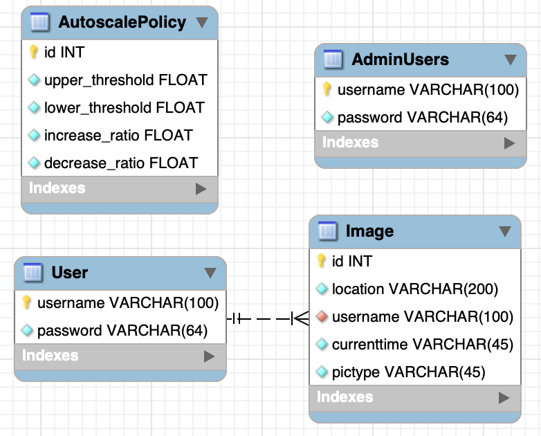 

There are four tables in the db. The User table takes username as the primary key and it stores users' credential information. The password stored is the hash of the original password concatenated with a per-user salt value. 

The Image table has an id incremented automatically and a foreign key referenced from the username in the user table. The image table also contains some image information, like the storage location of the image, the timestamp and the type of the image(i.e. original, processed or thumbnail). 

The AdminUsers table takes administrator's username as the primary key and it stores users' credential information. The password stored is the hash of the original password concatenated with a per-user salt value. 

The AutoscalePolicy table has an id incremented automatically. It also has upper threshold, lower threshold, increase ratio and decrease ratio that are related to the auto scaling of the workers. This database follows the 3NF.

## Auto Scaling Policy

Auto scaling policy has four parameters - upper threshold, lower threshold, increase ratio and decrease ratio. These parameters can be set by default or manually configured by manager.

* Upper threshold (%): 

  Once the CPU utilization is higher than the upper threshold, the auto-scaler would increase the number of instances based on increase ratio.

* Lower threshold (%): 
  
  Once the CPU utilization is lower than the lower threshold. the auto-scaler would decrease the number of instances based on decrease ratio.

* Increase ratio (>1): 

  Number of instances after auto-increment = Increase ratio * Current number of instances

* Decrease ratio (0~1)

  Number of instances after auto-decrement = Decrease ratio * Current number of instances

## Results


At 23:22, 23:26 and 23:30, we use load generator to upload 200 pictures each, in total 600 pictures. Auto-scaler runs every 60 seconds. It compares the average CPU utilization over past 2 minutes to upper and lower thresholds from Autoscale Policy. If Auto-scaler decides to resize the worker pool, the process can be completed within 90 seconds.

The autoscale policy in this demo is,
```
Upper threshold: 70%
Lower threshold: 30%
Increase ratio: 2
Decrease ratio: 0.5
```

### Scale up

Starting from 21:31, we used two load generators to upload pictures to test auto-scaler by turns and at the same time, which uploaded 2 and 4 pictures per seconds.  At 21:43, around 360 picture uploaded per minute, reaching the top inbound traffic in this particular test. In total, 1200 pictures were uploaded and processed.

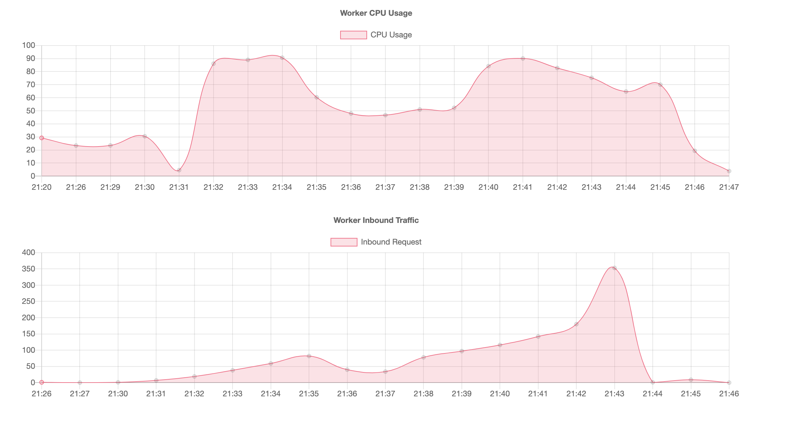 
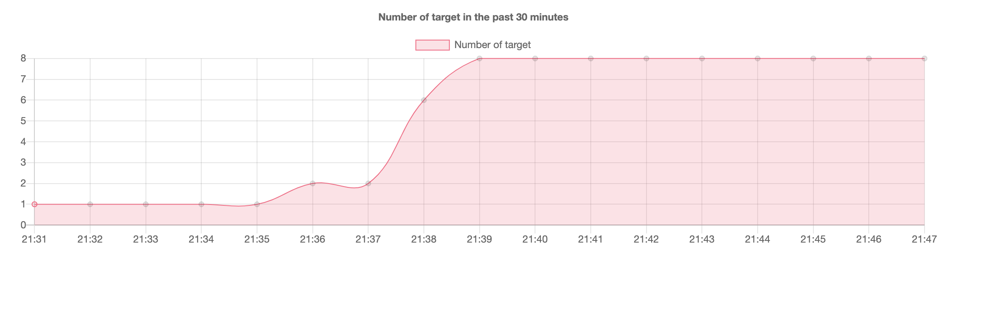 

The CPU utilization went over the upper threshold 70%, auto-scaler started to react. The number of target jumped to 8, which was able to process the load, therefore, it didn't reach 10.

### Scale down

After 1200 pictures uploaded and processed, the CPU utilization dropped down from 21:44. 
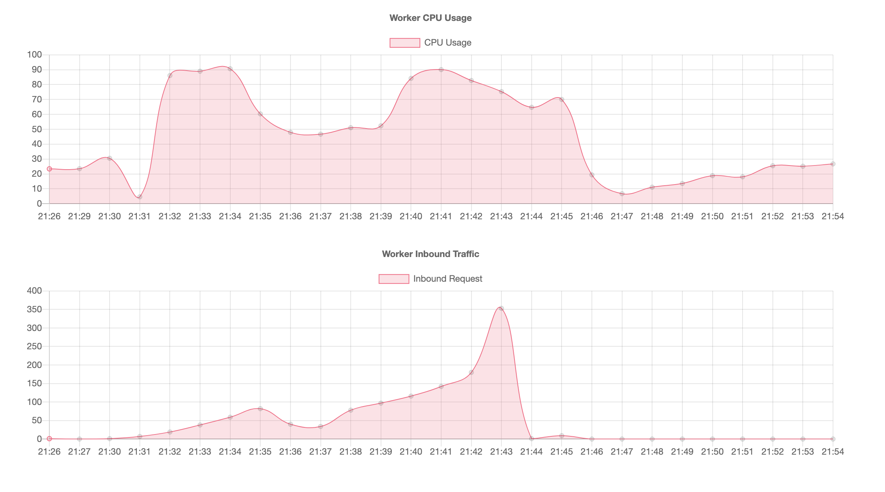 
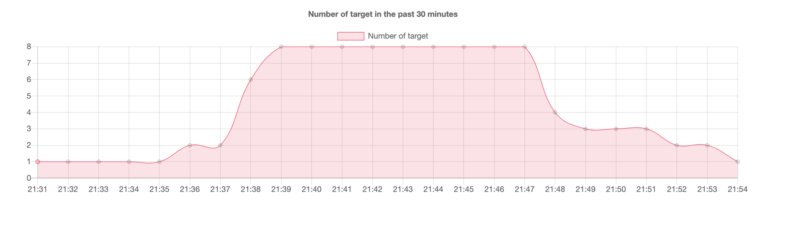 

After the user stops uploading pictures, the CPU utilization decrease to below 30%. It halves 8 instances to 4, then 2, eventually 1.

### Constant

From 21:54, the number of instance remained stable at 1. The average CPU utilization r

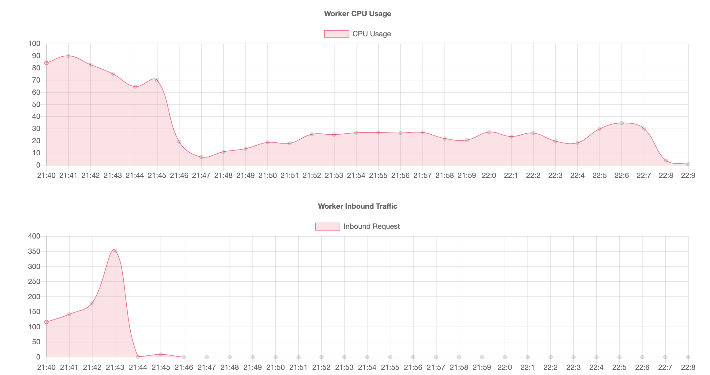 
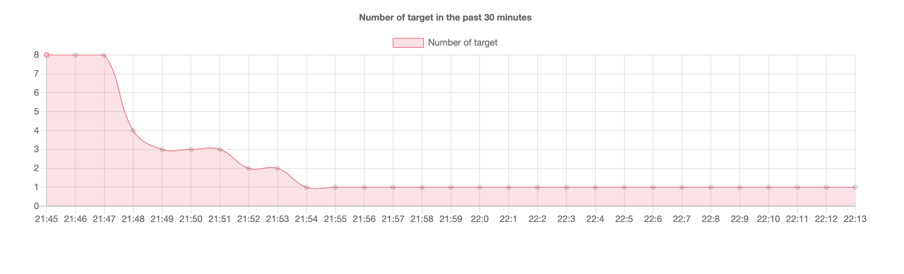 


## Error Handling

* 404 Not Found
* 403 Forbidden
* 401 Unauthorized 
* 400 Bad Request

## Assumptions
* Image Format: this application only accept format accepted by open cv framework, including bmp, pbm, pgm, ppm, sr, ras, jpeg, jpg, jpe, jp2, tiff, tif, png. The format should be explicitly identified as file extension. 

## Contribution of each member 
* Hongyu Liu 1005851295

  Stored information about user accounts and the location of photos owned by a user on
  AWS RDS. Implemented the auto-scaling algorithm. Improved the graphic user interfaces.  


* Ran Wang 1006126951

  Stored all photos (processed, unprocessed and thumbnails) in S3. Registered/Deregistered the workers to ELB.


* Zixiang Ma 1005597285

  Generated the two charts: total CPU utilization and the rate of HTTP requests. Generated the separate page showing the number of workers for the past 30 minutes. Added the register and login page for manager app. Generated a image for user app and deployed the manager app on EC2 instance. Generated IAM Roles to give permissions to the EC2 instances.
